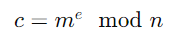
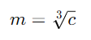

# RSA
100
The cryptography category is incomplete without RSA. So here is a simple RSA challenge. Have fun! Author: noob_abhinav

# Attachments
encryption.txt

# Walkthrough:

Understanding the RSA Encryption Scheme
In RSA encryption, the ciphertext
𝑐
c is computed using the formula:

Where:

𝑚
m is the plaintext message.
𝑒
e is the public exponent.
𝑛
n is the modulus (product of two large prime numbers).

Given:
e=3
𝑛
n is a large number.
𝑐
c is the ciphertext.

This means we can directly compute the e-th root of 
𝑐
c to retrieve 
𝑚
m:

# So we need to,
1. Compute the Cube Root of the Ciphertext c
2. Convert the Integer to Bytes: long_to_bytes
3. Decode the Bytes to Get the Flag

use the solve.py script to get the flag

# Flag
Flag: n00bz{crypt0_1s_1nc0mpl3t3_w1th0ut_rs4!!}
