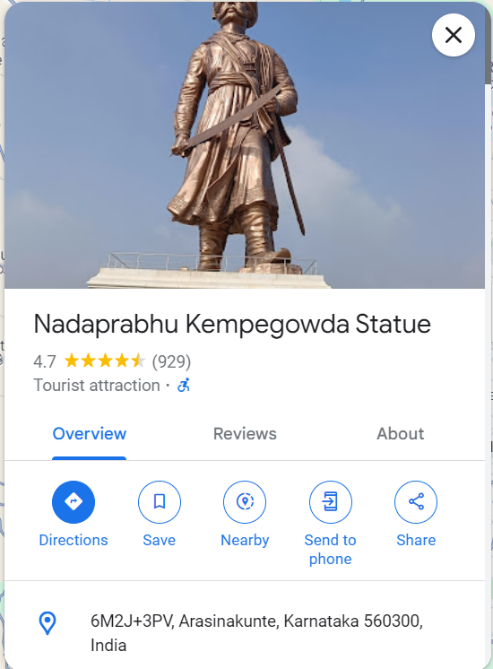

# The Gang 3
486
Can you find out where the OG meetup point is? The flag is in the format n00bz{lat,long} with upto 3 decimal places, rounded. Continue where you left off... Note: Wikipedia can be wrong sometimes ;) Author: NoobMaster

# Walkthrough:

Follow on from pt 2.
go back to johnhackerdoe X account
find the recent tweets
Says we have to solve  AES-GCM challenge

We need to find the key and location from 'last time' 
Check CTF n00bz past challenges
there is a challenge 'John doe strikes again' - https://ctftime.org/task/25539
The key is not given, so we search this challenge online for any resources
There are past articles on Medium stating the secret key - YouCanNeverCatchJohnDoe!
We go back to the CTF Challenges and look at OSINT challenges from 2022
There is a challenge called 'John Doe', lets analyse this - https://ctftime.org/task/22110
Although there are still no signs of the location we need, lets analyse the official write up - https://github.com/n00bzUnit3d/n00bzCTF-OfficialWriteups/tree/main/osint/john_doe
The flag for this challenge was - Flag - n00bz{46.720_33.154}, therefore we have found the coordinates

Go to cyber Chef and add in all the information we found

We get a discord link -  https://discord.gg/9v2FEjndCb

This leads to a discord invite link for a server called "The hangout"
Lets join and search for "OG meetup point" in messages sent
From the messages seen its implied John Doe is going to Bengaluru and meeting near a 110ft statue
We can google for "Bengaluru 110ft statue" and look at images/Google maps

From google maps we can get the coordinates for the statue and translate this to the flag

# Flag
n00bz{13.199,77.682}